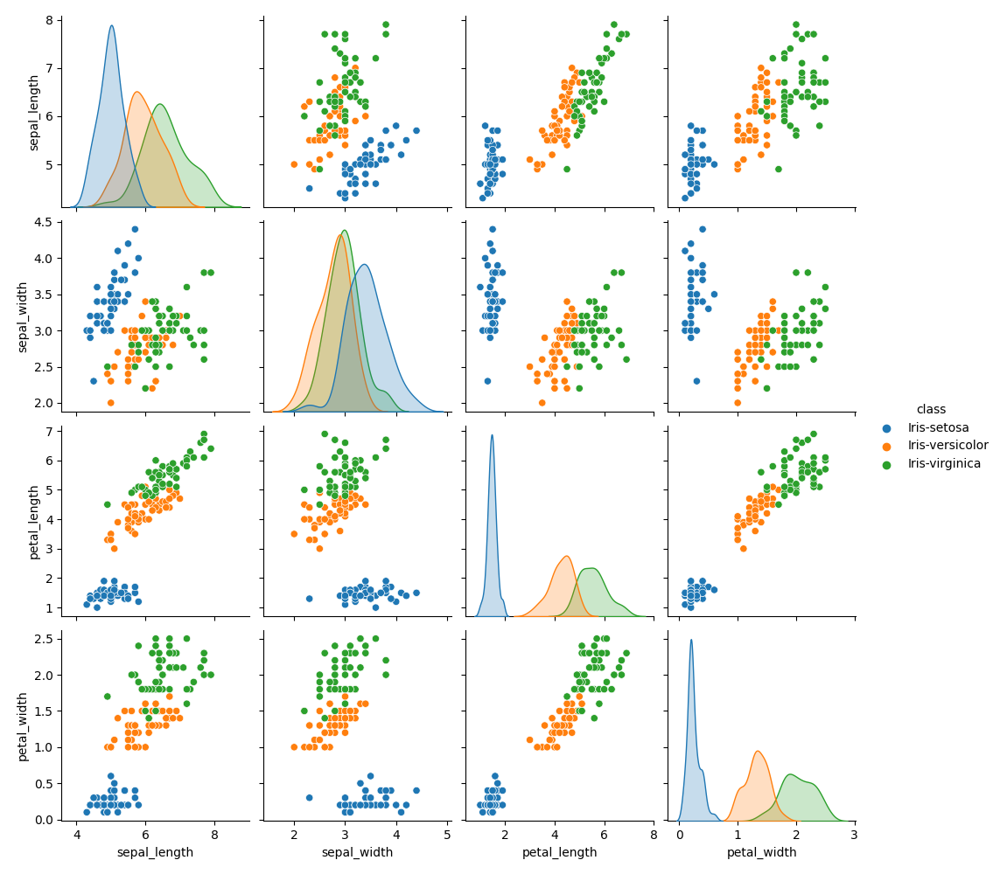
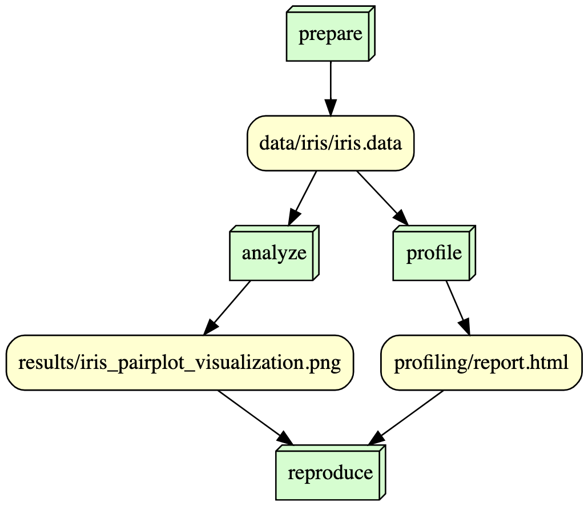

# is477-fall2023-final-project

## Overview
FILL ME

## Analysis
FILL ME

## Workflow

## Reproducing
If you would like to reproduce the contents of this project, please follow the following steps:
1. Clone this repository
2. Install Docker on your device if it has not been installed already
3. Run the following command to run all the scripts in this file:
docker run --rm -v ${PWD}:/is477 sarthakkatyal/is477-fall2023:final-project snakemake --cores 1 reproduce

## License
### Software License
The software license for this project is the MIT License, which was chosen because it is simple and permissive. This license only requires the preservation of copyright and license notices; it grants permission to anyone to copy, modify, merge, publish, distribute, sell, or sublicense the software. The actual copyright notice can be found in the LICENSE portion of this repository. Additionally, the MIT license can protect developers from legal liabilities since it does not provide warranties.

### Data License
The data license chosen is the Creative Commons Attribution 4.0 (CC-BY-4.0) Data License. This license requires attribution, but not share-alike. This license allows people to share and adapt the data as they would like as long as they provide the appropriate credit, a link to the license, and indicate if any changes were made. This license also ensures that others may not add legal terms or other restrictions that would stop other parties from doing what this license permits. 

This license was chosen because it facilitates collaboration and allows for easy access to data for analysis and perhaps generates novel analyses and interpretations.

## References
Fisher, R. A.. (1988). Iris. UCI Machine Learning Repository. https://doi.org/10.24432/C56C76.